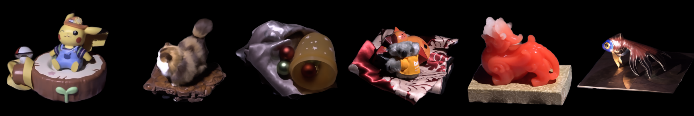

<p align="center">

  <h1 align="center">Relighting Neural Radiance Fields with Shadow and Highlight Hints</h1>
  <p align="center">
    <a href="https://www.chong-zeng.com/"><strong>Chong Zeng</strong></a>
    ·
    <a href="https://www.microsoft.com/en-us/research/people/guoch/"><strong>Guojun Chen</strong></a>
    ·
    <a href="https://yuedong.shading.me/"><strong>Yue Dong</strong></a>
    ·
    <a href="https://www.cs.wm.edu/~ppeers/"><strong>Pieter Peers</strong></a>
    ·
    <a href="https://svbrdf.github.io/"><strong>Hongzhi Wu</strong></a>
    ·
    <a href="https://www.microsoft.com/en-us/research/people/xtong/"><strong>Xin Tong</strong></a>
  </p>
  <h2 align="center">SIGGRAPH 2023 Conference Proceedings</h2>
  <div align="center">
    
  </div>

  <p align="center">
  <br>
    <a href="https://nrhints.github.io/"><strong>Project Page</strong></a>
    |
    <a href="https://nrhints.github.io/pdfs/nrhints-sig23.pdf"><strong>Paper</strong></a>
    |
    <a href="#data-and-models"><strong>Data</strong></a>
  </p>
</p>

---

# Setup

## Environment

We support Python 3.8+ and PyTorch 1.11+. After getting a required Python environment, you can setup the rest of requirements by running:

```bash
git clone https://github.com/iamNCJ/NRHints.git
cd NRHints
pip install -r requirements.txt
```

## Data

Our data is compatible with `NeRF Blender Dataset`, except that we have extra fields in each frame for point light position.

You can download our data [here](#data-and-models).

# Usage

## Configuration System

We use [tyro](https://github.com/brentyi/tyro) for configuration management. Description to all configurations can be found by running `python main.py -h`.

## Training

```bash
python3 main.py config:nr-hints --config.data.path /path/to/data/ --config.scene-name XXX
```

Refer to [train_synthetic.sh](scripts/train_synthetic.sh) and [train_real.sh](scripts/train_real.sh) for training on synthetic and real data, respectively.

## Testing

```bash
python3 main.py config:nr-hints --config.data.path /path/to/data/ --config.scene-name XXX --config.evaluation-only True
```

Refer to [eval_synthetic.sh](scripts/eval_synthetic.sh) and [eval_real.sh](scripts/eval_real.sh) for testing on synthetic and real data, respectively.

Our pretrained models can be downloaded [here](#data-and-models).


# Data and Models

## Real Captured Scenes

| Object      | Data        | Pre-trained model        |
| ----------- | :----------: | :-----------: |
| Cat | [Link](https://igpublicshare.z20.web.core.windows.net/NRHints/Data/Real/Cat.zip)        | [Link](https://igpublicshare.z20.web.core.windows.net/NRHints/Model/Real/Cat_step_1000000.ckpt) |
| Cluttered Scene  | [Link](https://igpublicshare.z20.web.core.windows.net/NRHints/Data/Real/FurScene.zip)        | [Link](https://igpublicshare.z20.web.core.windows.net/NRHints/Model/Real/FurScene_step_1000000.ckpt) |
| Pixiu Statuette   | [Link](https://igpublicshare.z20.web.core.windows.net/NRHints/Data/Real/Pixiu.zip)        | [Link](https://igpublicshare.z20.web.core.windows.net/NRHints/Model/Real/Pixiu_step_1000000.ckpt) |
| Ornamental Fish | [Link](https://igpublicshare.z20.web.core.windows.net/NRHints/Data/Real/Fish.zip)        | [Link](https://igpublicshare.z20.web.core.windows.net/NRHints/Model/Real/Fish_step_1000000.ckpt) |
| Cat on Decor   | [Link](https://igpublicshare.z20.web.core.windows.net/NRHints/Data/Real/CatSmall.zip)        | [Link](https://igpublicshare.z20.web.core.windows.net/NRHints/Model/Real/CatSmall_step_1000000.ckpt) |
| Cup and Fabric   | [Link](https://igpublicshare.z20.web.core.windows.net/NRHints/Data/Real/CupFabric.zip)        | [Link](https://igpublicshare.z20.web.core.windows.net/NRHints/Model/Real/CupFabric_step_1000000.ckpt) |
| Pikachu Statuette   | [Link](https://igpublicshare.z20.web.core.windows.net/NRHints/Data/Real/Pikachu.zip)        | [Link](https://igpublicshare.z20.web.core.windows.net/NRHints/Model/Real/Pikachu_step_1000000.ckpt) |

## Synthetic Rendered Scenes

| Object      | Data        | Pre-trained model        |
| ----------- | :----------: | :-----------: |
|  Diffuse  | [Link](https://igpublicshare.z20.web.core.windows.net/NRHints/Data/Synthetic/Cup_Plane_Diffuse_PL_500.zip)        | [Link](https://igpublicshare.z20.web.core.windows.net/NRHints/Model/Synthetic/Cup_Plane_Diffuse_PL_500_step_1000000.ckpt) |
|  Metallic  | [Link](https://igpublicshare.z20.web.core.windows.net/NRHints/Data/Synthetic/Cup_Plane_Metal_PL_500.zip)        | [Link](https://igpublicshare.z20.web.core.windows.net/NRHints/Model/Synthetic/Cup_Plane_Metal_PL_500_step_1000000.ckpt) |
|  Glossy-Metal  | [Link](https://igpublicshare.z20.web.core.windows.net/NRHints/Data/Synthetic/Cup_Plane_Metal_Rough_PL_500.zip)        | [Link](https://igpublicshare.z20.web.core.windows.net/NRHints/Model/Synthetic/Cup_Plane_Metal_Rough_PL_500_step_1000000.ckpt) |
|  Rough-Metal  | [Link](https://igpublicshare.z20.web.core.windows.net/NRHints/Data/Synthetic/Cup_Plane_Metal_VeryRough_PL_500.zip)        | [Link](https://igpublicshare.z20.web.core.windows.net/NRHints/Model/Synthetic/Cup_Plane_Metal_VeryRough_PL_500_step_1000000.ckpt) |
|  Anisotropic-Metal  | [Link](https://igpublicshare.z20.web.core.windows.net/NRHints/Data/Synthetic/Cup_Plane_Metal_Aniso_PL_500.zip)        | [Link](https://igpublicshare.z20.web.core.windows.net/NRHints/Model/Synthetic/Cup_Plane_Metal_Aniso_PL_500_step_1000000.ckpt) |
|  Plastic  | [Link](https://igpublicshare.z20.web.core.windows.net/NRHints/Data/Synthetic/Cup_Plane_NonMetal_PL_500.zip)        | [Link](https://igpublicshare.z20.web.core.windows.net/NRHints/Model/Synthetic/Cup_Plane_NonMetal_PL_500_step_1000000.ckpt) |
|  Glossy-Plastic  | [Link](https://igpublicshare.z20.web.core.windows.net/NRHints/Data/Synthetic/Cup_Plane_NonMetal_Rough_PL_500.zip)        | [Link](https://igpublicshare.z20.web.core.windows.net/NRHints/Model/Synthetic/Cup_Plane_NonMetal_Rough_PL_500_step_1000000.ckpt) |
|  Rough-Plastic  | [Link](https://igpublicshare.z20.web.core.windows.net/NRHints/Data/Synthetic/Cup_Plane_NonMetal_VeryRough_PL_500.zip)        | [Link](https://igpublicshare.z20.web.core.windows.net/NRHints/Model/Synthetic/Cup_Plane_NonMetal_VeryRough_PL_500_step_1000000.ckpt) |
|  Short-Fur  | [Link](https://igpublicshare.z20.web.core.windows.net/NRHints/Data/Synthetic/Cup_Plane_ShortFur_PL_500.zip)        | [Link](https://igpublicshare.z20.web.core.windows.net/NRHints/Model/Synthetic/Cup_Plane_ShortFur_PL_500_step_1000000.ckpt) |
|  Long-Fur  | [Link](https://igpublicshare.z20.web.core.windows.net/NRHints/Data/Synthetic/Cup_Plane_LongFur_PL_500.zip)        | [Link](https://igpublicshare.z20.web.core.windows.net/NRHints/Model/Synthetic/Cup_Plane_LongFur_PL_500_step_1000000.ckpt) |
|  Translucent  | [Link](https://igpublicshare.z20.web.core.windows.net/NRHints/Data/Synthetic/Cup_Plane_SSS_PL_500.zip)        | [Link](https://igpublicshare.z20.web.core.windows.net/NRHints/Model/Synthetic/Cup_Plane_SSS_PL_500_step_1000000.ckpt) |
|  Fur-Ball  | [Link](https://igpublicshare.z20.web.core.windows.net/NRHints/Data/Synthetic/FurBall_PL_500.zip)        | [Link](https://igpublicshare.z20.web.core.windows.net/NRHints/Model/Synthetic/FurBall_PL_500_step_1000000.ckpt) |
|  Basket  | [Link](https://igpublicshare.z20.web.core.windows.net/NRHints/Data/Synthetic/Basket_PL_500.zip)        | [Link](https://igpublicshare.z20.web.core.windows.net/NRHints/Model/Synthetic/Basket_PL_500_step_1000000.ckpt) |
|  Layered Woven Ball  | [Link](https://igpublicshare.z20.web.core.windows.net/NRHints/Data/Synthetic/Complex_Ball_PL_500.zip)        | [Link](https://igpublicshare.z20.web.core.windows.net/NRHints/Model/Synthetic/Complex_Ball_PL_500_step_1000000.ckpt) |
|  Drums  | [Link](https://igpublicshare.z20.web.core.windows.net/NRHints/Data/Synthetic/Drums_PL_500.zip)        | [Link](https://igpublicshare.z20.web.core.windows.net/NRHints/Model/Synthetic/Drums_PL_500_step_1000000.ckpt) |
|  Hotdog | [Link](https://igpublicshare.z20.web.core.windows.net/NRHints/Data/Synthetic/Hotdog_PL_500.zip)        | [Link](https://igpublicshare.z20.web.core.windows.net/NRHints/Model/Synthetic/Hotdog_PL_500_step_1000000.ckpt) |
|  Lego  | [Link](https://igpublicshare.z20.web.core.windows.net/NRHints/Data/Synthetic/Lego_PL_500.zip)        | [Link](https://igpublicshare.z20.web.core.windows.net/NRHints/Model/Synthetic/Lego_PL_500_step_1000000.ckpt) |

# Citation

Cite as below if you find this repository is helpful to your project:

```
@inproceedings {zeng2023nrhints,
    title      = {Relighting Neural Radiance Fields with Shadow and Highlight Hints},
    author     = {Chong Zeng and Guojun Chen and Yue Dong and Pieter Peers and Hongzhi Wu and Xin Tong},
    booktitle  = {ACM SIGGRAPH 2023 Conference Proceedings},
    year       = {2023}
}
```

# Acknowledgement

Some code snippets are borrowed from [NeuS](https://github.com/Totoro97/NeuS) and [Nerfstudio](https://nerf.studio/). Thanks for these great projects.
